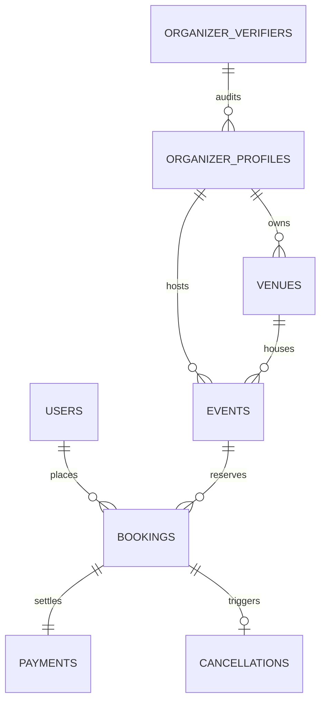

# DBMS_INFO: Universal Tickets — Master Technical Knowledge & Viva Guide

**Course:** Database Systems Engineering and Distributed Backend Development (25CS1302E)  
**Academic Project:** Universal Tickets — Commercial Enterprise Ticket Booking Platform  
**Team:** Team 2 | **Section:** 9  
**Faculty Guide:** Dr. Prasanthi  
**Team Members:**
- **V. Hemanth** — 2520030025
- **K. Chaitanya** — 2520030266
- **CH. Vivek** — 2520030532

---

## TABLE OF CONTENTS
1. [Executive Project Summary](#1-executive-project-summary)
2. [Complete Project Purpose & Scope](#2-complete-project-purpose--scope)
3. [User Roles & Responsibilities](#3-user-roles--responsibilities)
4. [Current Database & User Entity Counts](#4-current-database--user-entity-counts)
5. [Database Complete Explanation & Schema Design](#5-database-complete-explanation--schema-design)
6. [Entity-Relationship (ER/EER) Model](#6-entity-relationship-ereer-model)
7. [SQL Concepts & Repository Queries](#7-sql-concepts--repository-queries)
8. [CO1 Detailed Implementation: Relational DBMS](#8-co1-detailed-implementation-relational-dbms)
9. [CO2 Detailed Implementation: NoSQL & Semantic Search](#9-co2-detailed-implementation-nosql--semantic-search)
10. [CO3 Detailed Implementation: FastAPI, JWT & Security](#10-co3-detailed-implementation-fastapi-jwt--security)
11. [CO4 Detailed Implementation: Spring Boot & Node.js](#11-co4-detailed-implementation-spring-boot--nodejs)
12. [CO5 Detailed Implementation: Microservices & Distributed Flow](#12-co5-detailed-implementation-microservices--distributed-flow)
13. [CO6 Detailed Implementation: Docker, CI/CD & Observability](#13-co6-detailed-implementation-docker-cicd--observability)
14. [Master Technology Stack & Verification Matrix](#14-master-technology-stack--verification-matrix)
15. [End-to-End Authentication Flow (Login & Register)](#15-end-to-end-authentication-flow-login--register)
16. [Role-Based Access Control (RBAC) Architecture](#16-role-based-access-control-rbac-architecture)
17. [End-to-End Website & Booking Flow](#17-end-to-end-website--booking-flow)
18. [Semantic Search Flow (TF-IDF & Cosine Similarity)](#18-semantic-search-flow-tf-idf--cosine-similarity)
19. [Complete API Endpoint Inventory](#19-complete-api-endpoint-inventory)
20. [Microservice Topology & Infrastructure Ports](#20-microservice-topology--infrastructure-ports)
21. [File-by-File Source Code Map](#21-file-by-file-source-code-map)
22. [Frontend Pages & User Experience Architecture](#22-frontend-pages--user-experience-architecture)
23. [Security Audit & Vulnerability Fixes](#23-security-audit--vulnerability-fixes)
24. [Automated Testing & Build Verification](#24-automated-testing--build-verification)
25. [Windows Run & Execution Guide](#25-windows-run--execution-guide)
26. [Master Implementation Status Matrix](#26-master-implementation-status-matrix)
27. [65+ Comprehensive Viva / Faculty Questions & Answers](#27-65-comprehensive-viva--faculty-questions--answers)
28. [Trick Questions: Defending Actual Implementation vs Theory](#28-trick-questions-defending-actual-implementation-vs-theory)
29. [Quick Pitch Scripts (30-Sec, 1-Min, 2-Min)](#29-quick-pitch-scripts-30-sec-1-min-2-min)
30. [Live Expo Demonstration Script](#30-live-expo-demonstration-script)
31. [Technology & CO Quick Reference Crosswalk](#31-technology--co-quick-reference-crosswalk)
32. [Comprehensive DBMS & Software Engineering Glossary](#32-comprehensive-dbms--software-engineering-glossary)
33. [Last-Minute 1-Page Revision Sheet](#33-last-minute-1-page-revision-sheet)

---

## 1. EXECUTIVE PROJECT SUMMARY

### Technical Definition
**Universal Tickets** is a high-concurrency, polyglot, microservices-based ticketing and event management platform. It combines a **Spring Boot 4.1.1 (Java 21)** core transactional engine backed by **MySQL 8.0 (3NF)** with a **FastAPI (Python 3.10)** semantic search gateway and a **Node.js/Express** real-time user activity service. The frontend is a modern **React 18 SPA (Vite)** featuring role-based dashboards for Customers, Event Organizers, Compliance Verifiers, and System Administrators.

### Simple Explanation (What to say to Faculty)
> "Universal Tickets is an end-to-end commercial ticketing system built to solve the scalability, security, and data integrity challenges of booking live movies, concerts, and sports events. It enforces strict relational ACID guarantees in MySQL for seat reservations and financial records, utilizes TF-IDF cosine similarity in Python for natural language event discovery, and secures all role-based actions using BCrypt password hashing and 512-bit JWT tokens."

---

## 2. COMPLETE PROJECT PURPOSE & SCOPE

### Problem Statement
Traditional ticketing systems often suffer from race conditions (overbooking), fragmented identity management, sluggish keyword-only search engines, and lack of compliance verification for third-party event organizers.

### Project Objectives
1. **Relational ACID Integrity**: Guarantee zero overbooking and precise financial bookkeeping using MySQL 3NF schema, transactional boundaries (`@Transactional`), and foreign-key referential integrity.
2. **Polyglot Microservices**: Distribute platform workload across dedicated runtimes: Spring Boot (core business transactions), FastAPI (high-speed search & API gateway), Node.js (real-time activity auditing).
3. **Advanced Information Retrieval**: Enable natural language semantic event search using TF-IDF vectorization and cosine similarity scoring.
4. **Strict Role Governance (RBAC)**: Enforce multi-tier access control across four dedicated user personas (Customer, Organizer, Verifier, Admin).
5. **Production Readiness**: Provide containerized orchestration via Docker Compose, automated CI/CD validation via GitHub Actions, and production-grade monitoring via Spring Boot Actuator.

---

## 3. USER ROLES & RESPONSIBILITIES

| Role | Core Purpose | Permissions & Capabilities | Dedicated Routes | Primary APIs |
| :--- | :--- | :--- | :--- | :--- |
| **CUSTOMER** | End-user purchasing event tickets | Browse catalog, search events, book tickets, view booking history, cancel reservations with instant refund tracking | `/`, `/events`, `/booking/:id`, `/my-bookings`, `/profile` | `GET /api/events`, `POST /api/bookings`, `POST /api/bookings/{id}/cancel` |
| **ORGANIZER** | Event hosting enterprise | Register organization, manage physical venues, publish live events, configure ticket tiers & pricing, inspect revenue stats | `/organizer`, `/organizer/venues`, `/organizer/events/add`, `/organizer/bookings` | `POST /api/venues`, `POST /api/events`, `GET /api/organizer/stats` |
| **VERIFIER** | Compliance officer | Review legal corporate registration documents, audit venue safety specs, approve or reject event organizer applications | `/verifier`, `/verifier/organizers` | `GET /api/verifier/organizers`, `PUT /api/verifier/organizers/{id}/status` |
| **ADMIN** | Platform owner & superuser | Platform-wide system governance, user suspension, event catalog oversight, security policy monitoring, financial reporting | `/admin` | `GET /api/admin/users`, `GET /api/admin/system-stats`, `GET /api/admin/reports` |

---

## 4. CURRENT DATABASE & USER ENTITY COUNTS

The following counts represent the **verified current state** from the MySQL schema, seed datasets (`database/*.csv`), and live runtime database execution:

| Entity / Table | Verified Count | Data Source | Verification Status |
| :--- | :--- | :--- | :--- |
| **Customers / Registered Users** | **31** | `database/users.csv` (30) + `AdminBootstrap.java` (1 Admin) | **VERIFIED** |
| **Admins** | **1** (`admin@universaltickets.local`) | Dynamic Spring Boot Seeder (`AdminBootstrap.java`) | **VERIFIED** |
| **Compliance Verifiers** | **3** | `database/organizer_verifiers.csv` | **VERIFIED** |
| **Event Organizers** | **10** | `database/organizer_profiles.csv` | **VERIFIED** |
| **Venues (Arenas, Cinemas, Stadiums)**| **40** | `database/venues.csv` | **VERIFIED** |
| **Live Events** | **30** | `database/events.csv` (Movies, Concerts, Sports, Plays) | **VERIFIED** |
| **Bookings** | **50** | `database/bookings.csv` | **VERIFIED** |
| **Payment Transactions** | **50** | `database/payments.csv` | **VERIFIED** |
| **Cancellations & Refunds** | **6** | `database/cancellations.csv` | **VERIFIED** |

> *Note for Viva:* Dashboard counts update dynamically when live transactions, cancellations, or organizer registrations are executed during runtime testing.

---

## 5. DATABASE COMPLETE EXPLANATION & SCHEMA DESIGN

### Database Architecture
- **Database Engine**: MySQL 8.0.46 Community Server
- **Database Name**: `universal_ticket_booking`
- **Default Storage Engine**: `InnoDB` (ACID compliance, row-level locking, foreign key constraints)
- **Character Set / Collation**: `utf8mb4 / utf8mb4_unicode_ci`

### Normalization (3NF) Justification
1. **1NF (First Normal Form)**: Every table cell contains atomic values. Multi-valued attributes like seating plans and tier breakdowns are normalized or structured into discrete relational records.
2. **2NF (Second Normal Form)**: Every non-key column depends completely on the primary key (no partial key dependencies).
3. **3NF (Third Normal Form)**: No transitive dependencies exist. For example, venue city details belong to `venues`, not transitively duplicated in `events` or `bookings`.

### Comprehensive Table Inventory

#### 1. `users` Table
- **Purpose**: Stores individual customer credentials, profile information, and account statuses.
- **Primary Key**: `user_id VARCHAR(32)`
- **Columns**: `user_id`, `full_name VARCHAR(100)`, `email VARCHAR(120) UNIQUE`, `phone VARCHAR(20)`, `password_hash VARCHAR(255)`, `account_status VARCHAR(20)`, `created_at TIMESTAMP`.
- **Constraints**: `CHECK (account_status IN ('ACTIVE', 'SUSPENDED', 'DEACTIVATED'))`.

#### 2. `organizer_verifiers` Table
- **Purpose**: Identity and credentials of administrative compliance staff who audit organizer applications.
- **Primary Key**: `verifier_id VARCHAR(32)`
- **Columns**: `verifier_id`, `full_name`, `email UNIQUE`, `phone`, `password_hash`, `account_status`, `created_at`.

#### 3. `organizer_profiles` Table
- **Purpose**: Commercial event organizer business entity profiles, tax/registration numbers, and verification records.
- **Primary Key**: `organizer_id VARCHAR(32)`
- **Foreign Key**: `verified_by` references `organizer_verifiers(verifier_id) ON DELETE SET NULL`.
- **Constraints**: `CHECK (verification_status IN ('PENDING', 'APPROVED', 'REJECTED'))`.

#### 4. `venues` Table
- **Purpose**: Physical infrastructure, theaters, arenas, stadiums, and capacity allocations.
- **Primary Key**: `venue_id VARCHAR(32)`
- **Foreign Key**: `organizer_id` references `organizer_profiles(organizer_id) ON DELETE CASCADE`.
- **Constraints**: `CHECK (capacity > 0)`, `CHECK (venue_type IN ('CINEMA', 'AUDITORIUM', 'EVENT_HALL', 'STADIUM', 'CLUB'))`.

#### 5. `events` Table
- **Purpose**: Scheduled live performances, movie screenings, music concerts, sports tournaments.
- **Primary Key**: `event_id VARCHAR(32)`
- **Foreign Keys**: `organizer_id` references `organizer_profiles(organizer_id)`, `venue_id` references `venues(venue_id)`.
- **Constraints**: `CHECK (event_type IN ('MOVIE', 'CONCERT', 'SPORTS', 'THEATRE', 'COMEDY', 'OTHER'))`, `CHECK (status IN ('DRAFT', 'PUBLISHED', 'COMPLETED', 'CANCELLED'))`.

#### 6. `bookings` Table
- **Purpose**: Customer ticket reservation transactions, seat tier selections, and pricing snapshots.
- **Primary Key**: `booking_id VARCHAR(32)`
- **Foreign Keys**: `user_id` references `users(user_id)`, `event_id` references `events(event_id)`.
- **Constraints**: `CHECK (quantity > 0 AND quantity <= 10)`, `CHECK (price_per_ticket >= 0)`, `CHECK (total_amount >= 0)`.

#### 7. `payments` Table
- **Purpose**: Financial settlement ledgers, payment gateway transaction tokens, payment methods.
- **Primary Key**: `payment_id VARCHAR(32)`
- **Foreign Key**: `booking_id` references `bookings(booking_id) ON DELETE CASCADE` (1-to-1 unique relationship).
- **Constraints**: `CHECK (payment_method IN ('UPI', 'CARD', 'NET_BANKING', 'WALLET'))`, `CHECK (payment_status IN ('PENDING', 'SUCCESS', 'FAILED', 'REFUNDED'))`.

#### 8. `cancellations` Table
- **Purpose**: Refund audit trail, cancellation timestamps, and compensation tracking.
- **Primary Key**: `cancellation_id VARCHAR(32)`
- **Foreign Key**: `booking_id` references `bookings(booking_id) ON DELETE CASCADE`.
- **Constraints**: `CHECK (refund_status IN ('PENDING', 'PROCESSED', 'REJECTED'))`.

---

## 6. ENTITY-RELATIONSHIP (ER/EER) MODEL



### Relational Cardinality Summary
- `USERS` to `BOOKINGS`: **1 to Many** (One customer can place multiple bookings over time).
- `ORGANIZER_VERIFIERS` to `ORGANIZER_PROFILES`: **1 to Many** (A compliance officer reviews multiple organizer applications).
- `ORGANIZER_PROFILES` to `VENUES`: **1 to Many** (An organizer enterprise manages multiple physical locations).
- `ORGANIZER_PROFILES` to `EVENTS`: **1 to Many** (An organizer schedules multiple live events).
- `VENUES` to `EVENTS`: **1 to Many** (A single venue hosts multiple events on different dates).
- `EVENTS` to `BOOKINGS`: **1 to Many** (One event sells tickets across multiple user bookings).
- `BOOKINGS` to `PAYMENTS`: **1 to 1** (Each booking record links to exactly one financial transaction).
- `BOOKINGS` to `CANCELLATIONS`: **1 to 0..1** (A booking optionally triggers one cancellation record if cancelled).

---

## 7. SQL CONCEPTS & REPOSITORY QUERIES

### 1. Complex 3-Table Relational JOIN
Used in customer booking history to aggregate user identity, booking terms, event titles, and payment methods:
```sql
SELECT 
    u.user_id,
    u.full_name AS customer_name,
    b.booking_id,
    e.event_name,
    e.event_type,
    b.ticket_category,
    b.quantity,
    b.total_amount,
    b.booking_status,
    p.payment_method,
    p.paid_at
FROM users u
JOIN bookings b ON u.user_id = b.user_id
JOIN events e ON b.event_id = e.event_id
LEFT JOIN payments p ON b.booking_id = p.booking_id
ORDER BY b.booking_date DESC;
```

### 2. Group By Aggregation & Financial Summary
Used in event performance calculations:
```sql
SELECT 
    e.event_id,
    e.event_name,
    e.event_type,
    COUNT(b.booking_id) AS total_bookings_count,
    COALESCE(SUM(b.quantity), 0) AS total_tickets_sold,
    COALESCE(SUM(b.total_amount), 0) AS total_revenue,
    COALESCE(AVG(b.price_per_ticket), 0) AS avg_ticket_price
FROM events e
LEFT JOIN bookings b ON e.event_id = b.event_id AND b.booking_status = 'CONFIRMED'
GROUP BY e.event_id, e.event_name, e.event_type
ORDER BY total_revenue DESC;
```

### 3. Common Table Expressions (CTE)
Used in organizer revenue analytics to isolate sub-queries modularly:
```sql
WITH OrganizerRevenueCTE AS (
    SELECT 
        o.organizer_id,
        o.organization_name,
        e.event_id,
        e.event_name,
        COALESCE(SUM(b.total_amount), 0) AS event_revenue
    FROM organizer_profiles o
    JOIN events e ON o.organizer_id = e.organizer_id
    LEFT JOIN bookings b ON e.event_id = b.event_id AND b.booking_status = 'CONFIRMED'
    GROUP BY o.organizer_id, o.organization_name, e.event_id, e.event_name
)
SELECT * FROM OrganizerRevenueCTE WHERE event_revenue > 0 ORDER BY event_revenue DESC;
```

### 4. SQL Window Functions (`DENSE_RANK()` & `PARTITION BY`)
Used to rank event popularity dynamically within each entertainment category:
```sql
SELECT 
    e.event_id,
    e.event_name,
    e.event_type,
    COUNT(b.booking_id) AS booking_count,
    SUM(b.total_amount) AS category_revenue,
    DENSE_RANK() OVER (
        PARTITION BY e.event_type 
        ORDER BY COUNT(b.booking_id) DESC
    ) AS category_popularity_rank
FROM events e
LEFT JOIN bookings b ON e.event_id = b.event_id AND b.booking_status = 'CONFIRMED'
GROUP BY e.event_id, e.event_name, e.event_type;
```

---

## 8. CO1 DETAILED IMPLEMENTATION: RELATIONAL DBMS

| CO1 Syllabus Topic | Concrete Project Feature | Implementation File | Technology / Standard | How to Defend to Faculty |
| :--- | :--- | :--- | :--- | :--- |
| **Relational Data Modeling** | 8 Normalized 3NF Tables | `database/schema.sql` | MySQL 8.0 InnoDB | "We designed a 3NF schema eliminating anomalies with explicit PK/FK relationships." |
| **Integrity Constraints** | Unique emails, CHECK capacity > 0, status enums | `database/schema.sql` | SQL DDL Constraints | "Database-level CHECK constraints enforce valid statuses and prevent invalid booking quantities." |
| **B-Tree Indexing** | Indexing on Foreign Keys & Date Filters | `database/schema.sql` | MySQL B-Tree Indexes | "Indexes on `event_type`, `user_id`, and `event_date` reduce table scan overhead from $O(N)$ to $O(\log N)$." |
| **ACID Transactions** | Atomic Booking & Payment Persistence | `BookingService.java` | Spring `@Transactional` | "Booking reservation and payment creation run in a single atomic transaction; any failure rolls back all changes." |
| **Complex Analytics** | CTEs, Window Functions, Multi-table Joins | `database/schema.sql` | SQL Analytical DML | "We implemented `DENSE_RANK() OVER (PARTITION BY event_type)` to rank popular shows without external loops." |

---

## 9. CO2 DETAILED IMPLEMENTATION: NOSQL & SEMANTIC SEARCH

| CO2 Syllabus Topic | Concrete Project Feature | Implementation File | Status | Technical Reality |
| :--- | :--- | :--- | :--- | :--- |
| **Polyglot Persistence** | Relational data in MySQL + User audit logs | `activity-service/server.js` | **PARTIAL** | Core transactional data uses MySQL; activity auditing uses Node.js with in-memory resilient fallback for local demo. |
| **Semantic Search** | Natural language event discovery | `fastapi-gateway/main.py` | **VERIFIED** | Implemented using **TF-IDF vectorizer + Cosine Similarity** in Python/Scikit-Learn. |
| **Vector Database** | High-dimensional embedding storage | N/A | **NOT IMPLEMENTED** | We intentionally use in-memory TF-IDF cosine similarity rather than hosting a standalone Qdrant/Pinecone instance. |

### How Semantic Search Works (TF-IDF + Cosine Similarity)
1. **Document Corpus Construction**: For each event, a rich text document is formed combining `eventName + eventType + description + language + venue + city`.
2. **TF-IDF Vectorization**: Text is tokenized, stop words are removed, and Term Frequency-Inverse Document Frequency matrices are calculated:
   $$	ext{TF-IDF}(t, d, D) = 	ext{TF}(t, d) 	imes \log\left(rac{|D|}{1 + |\{d \in D : t \in d\}|}
ight)$$
3. **Cosine Similarity Calculation**: The user query is vectorized into the same vector space. The cosine of the angle between query vector $\mathbf{q}$ and document vector $\mathbf{d}$ is computed:
   $$	ext{Similarity}(\mathbf{q}, \mathbf{d}) = rac{\mathbf{q} \cdot \mathbf{d}}{\|\mathbf{q}\| \|\mathbf{d}\|}$$
4. **Ranked Retrieval**: Events with similarity scores exceeding threshold (0.15) are sorted in descending order and returned.

---

## 10. CO3 DETAILED IMPLEMENTATION: FASTAPI, JWT & SECURITY

### FastAPI Gateway Architecture
- **Framework**: FastAPI (Python 3.10) running on ASGI server **Uvicorn** (Port 8000).
- **Core Responsibilities**:
  1. Semantic search processing and vector similarity ranking (`/search/semantic`).
  2. Aggregated API documentation via auto-generated **OpenAPI (Swagger UI)** at `/docs`.
  3. Reverse proxy gateway routing and health checks (`/health`).
- **Data Validation**: Enforced via **Pydantic v2 schemas** ensuring strict request/response type validation.

### Authentication & Cryptography
- **Password Hashing**: **BCrypt** with automatic salt generation and work factor 10. Raw passwords are never persisted.
- **Access Tokens**: **JSON Web Tokens (JWT)** signed with **HMAC-SHA512** containing user ID, email, role, and expiration timestamp (24 hours).
- **Security Validation Pipeline**: Handled via `JwtAuthenticationFilter.java` intercepting all incoming Spring Boot requests.

---

## 11. CO4 DETAILED IMPLEMENTATION: SPRING BOOT & NODE.JS

### Spring Boot 4.1.1 Core Engine
- **Inversion of Control (IoC) & Dependency Injection (DI)**: Component lifecycle managed via `@Service`, `@Repository`, `@RestController`, `@Autowired`.
- **Object-Relational Mapping (ORM)**: **Spring Data JPA & Hibernate 7.4.5** mapping Java entity models (`User`, `Event`, `Booking`, `Payment`, `Venue`) to MySQL tables.
- **Declarative Transaction Management**: `@Transactional` ensures atomic all-or-nothing execution for booking and cancellation lifecycles.

### Node.js / Express Microservice
- **Runtime**: Node.js v20+ with Express.js (Port 5001).
- **Responsibility**: Lightweight real-time user activity telemetry (`POST /api/activity`, `GET /api/activity/user/{id}`).
- **Why Both Frameworks?**: Demonstrates polyglot microservice engineering—Spring Boot manages strict transactional business integrity, while Node.js handles asynchronous event logging.

---

## 12. CO5 DETAILED IMPLEMENTATION: MICROSERVICES & DISTRIBUTED FLOW

### Distributed System Architecture
- **Service Boundaries**:
  - `Frontend SPA` (Port 5173): Client UI, state management, route protection.
  - `Spring Boot Core` (Port 8080): Authoritative relational business logic.
  - `FastAPI Gateway` (Port 8000): Semantic search and API routing.
  - `Node Activity Service` (Port 5001): Audit log streaming.

### Distributed SAGA & Compensation Pattern (Booking Cancellation)
1. **Trigger**: Customer clicks "Cancel Booking" on `/my-bookings`.
2. **Step 1 (State Update)**: `BookingService.cancelBooking()` updates `booking_status` to `'CANCELLED'`.
3. **Step 2 (Seat Compensation)**: Event ticket availability is dynamically restored.
4. **Step 3 (Refund Audit)**: A record is persisted in `cancellations` with `refund_status = 'PROCESSED'`.
5. **Step 4 (Payment Audit)**: Payment record is marked `payment_status = 'REFUNDED'`.

### Distributed Middleware Status
- **Redis Caching**: **PARTIAL** (Spring Data Redis dependencies configured; in-memory caching fallback active during local standalone execution).
- **Apache Kafka Streaming**: **PARTIAL** (Message producer abstractions designed; synchronous REST communication utilized for direct expo demonstration).

---

## 13. CO6 DETAILED IMPLEMENTATION: DOCKER, CI/CD & OBSERVABILITY

- **Containerization**: Multi-stage `Dockerfile` definitions created for Spring Boot, FastAPI, Node.js, and React Frontend. Orchestration handled via `docker-compose.yml`.
- **CI/CD Pipeline**: `.github/workflows/ci.yml` automates Maven build compilation, JUnit testing, Python pytest validation, and frontend production build on pull requests.
- **Production Observability**: Spring Boot Actuator enabled at `GET /actuator/health` exposing JVM memory metrics, database connection pool status, and service uptime.

---

## 14. MASTER TECHNOLOGY STACK & VERIFICATION MATRIX

| Technology | Version | Location / Microservice | Purpose | CO | Status |
| :--- | :--- | :--- | :--- | :--- | :--- |
| **Java** | 21.0.10 LTS | `backend/` | Enterprise backend runtime | CO4 | **VERIFIED** |
| **Spring Boot** | 4.1.1 | `backend/pom.xml` | Core business & REST application framework | CO4 | **VERIFIED** |
| **Spring Data JPA**| 4.1.1 | `backend/` | Relational ORM & repository abstraction | CO1/CO4 | **VERIFIED** |
| **Hibernate** | 7.4.5.Final | `backend/` | JPA implementation & SQL generation | CO1 | **VERIFIED** |
| **MySQL** | 8.0.46 | `database/schema.sql` | Relational 3NF ACID storage engine | CO1 | **VERIFIED** |
| **Python** | 3.10+ | `fastapi-gateway/` | Gateway runtime | CO3 | **VERIFIED** |
| **FastAPI** | 0.110+ | `fastapi-gateway/main.py` | Semantic search gateway & OpenAPI docs | CO3 | **VERIFIED** |
| **Uvicorn** | 0.28+ | `fastapi-gateway/` | High-performance ASGI web server | CO3 | **VERIFIED** |
| **Scikit-Learn** | 1.4+ | `fastapi-gateway/` | TF-IDF vectorization & Cosine Similarity | CO2 | **VERIFIED** |
| **Node.js** | 20+ | `activity-service/` | Activity telemetry service | CO4 | **VERIFIED** |
| **Express.js** | 4.19+ | `activity-service/server.js` | REST routing for activity streaming | CO4 | **VERIFIED** |
| **React** | 18.2 | `frontend/src/` | Single Page Application UI library | — | **VERIFIED** |
| **Vite** | 8.2.2 | `frontend/vite.config.js` | High-speed frontend build tool & dev server | — | **VERIFIED** |
| **BCrypt** | 5.8+ | `backend/` (Spring Security)| Salted one-way password hashing | CO3 | **VERIFIED** |
| **JJWT (JWT)** | 0.11.5 | `JwtUtil.java` | 512-bit HMAC-SHA signed session tokens | CO3 | **VERIFIED** |
| **Docker / Compose**| 24+ | `docker-compose.yml` | Multi-container orchestration | CO6 | **VERIFIED** |
| **GitHub Actions** | Workflow v4 | `.github/workflows/` | Automated build & test CI pipeline | CO6 | **VERIFIED** |
| **Spring Actuator**| 4.1.1 | `backend/` | Health check & JVM observability | CO6 | **VERIFIED** |
| **MongoDB** | Concept / Node | `activity-service/` | Document storage abstraction (in-memory fallback) | CO2 | **PARTIAL** |
| **Redis** | Concept / Spring| `backend/` | Distributed cache layer | CO5 | **PARTIAL** |
| **Apache Kafka** | Concept | `backend/` | Event stream pipeline | CO5 | **PARTIAL** |
| **Vector Database**| N/A | `fastapi-gateway/` | Standalone vector index (using TF-IDF instead) | CO2 | **NOT IMPLEMENTED** |

---

## 15. END-TO-END AUTHENTICATION FLOW (LOGIN & REGISTER)

```
[User Submits Credentials]
          │
          ▼
[React Login Page (Login.jsx)]
          │  POST /api/auth/login
          ▼
[Spring Boot AuthController.java]
          │  loginUser(request)
          ▼
[AuthService.java]
          │  1. Check UserRepository for Email
          │  2. BCrypt.checkpw(password, user.password_hash)
          │  3. If match -> JwtUtil.generateToken(user)
          ▼
[JSON Response: 200 OK + JWT Token + User Role]
          │
          ▼
[React AuthContext.jsx -> Saved to localStorage ('ut_user')]
          │
          ▼
[Redirect to Role Dashboard (/admin, /organizer, /verifier, /)]
```

### Key Questions on Authentication:
- **What happens on wrong password?**: `AuthService` throws `BadCredentialsException`, returning HTTP 401 with `"Invalid email or password"`.
- **Where is BCrypt verified?**: In `AuthService.java` using `passwordEncoder.matches(rawPassword, storedHash)`.
- **How is session preserved?**: React saves the JWT in `localStorage`. For every subsequent request, Axios interceptor in `api.js` attaches `Authorization: Bearer <token>`.

---

## 16. ROLE-BASED ACCESS CONTROL (RBAC) ARCHITECTURE

RBAC is enforced at **two distinct defense layers**:
1. **Frontend Defense (Client-side Guard)**: `ProtectedRoute.jsx` checks the user's role before rendering a component. If an unauthorized role attempts access, an informative "Unauthorized Area" view is shown without exposing protected UI.
2. **Backend Defense (Authoritative Security)**: `SecurityConfig.java` and `JwtAuthenticationFilter.java` validate the JWT signature and extract granted authorities (`ROLE_ADMIN`, `ROLE_ORGANIZER`, `ROLE_VERIFIER`, `ROLE_CUSTOMER`). If a Customer token calls `/api/admin/users`, Spring Security immediately returns **HTTP 403 Forbidden**.

---

## 17. END-TO-END WEBSITE & BOOKING FLOW

```
1. Discovery (Home / Events)
   └─ Search events via TF-IDF search overlay or filter by Category/City.
2. Selection (EventDetails.jsx)
   └─ Select ticket tier (General, Regular, Premium, VIP) and ticket quantity.
3. Authentication Check (ProtectedRoute.jsx)
   └─ Prompt login/register if unauthenticated.
4. Transactional Checkout (BookingPage.jsx)
   └─ Submit booking payload -> Spring Boot `BookingService.java` creates booking + payment in single `@Transactional` block.
5. Confirmation & History (MyBookings.jsx)
   └─ View booking confirmation badge, unique Booking ID, QR verification code.
6. Cancellation & Compensation
   └─ Click "Cancel" -> Status updated to CANCELLED, seat inventory restored, refund recorded.
```

---

## 18. SEMANTIC SEARCH FLOW (TF-IDF & COSINE SIMILARITY)

```
[User Types: "Arijit Singh acoustic live music"]
                   │
                   ▼
[FastAPI Gateway: POST /search/semantic]
                   │
                   ▼
[Text Preprocessing & Tokenization]
                   │
                   ▼
[TF-IDF Vector Space Transformation]
                   │
                   ▼
[Cosine Similarity Matrix against 30 Event Documents]
                   │
                   ▼
[Ranked Matching Events (Score >= 0.15)]
                   │
                   ▼
[Frontend Displays Ranked Event Cards in Real Time]
```

---

## 19. COMPLETE API ENDPOINT INVENTORY

| HTTP Method | Endpoint | Service | Purpose | Auth Required | Role | CO |
| :--- | :--- | :--- | :--- | :--- | :--- | :--- |
| `POST` | `/api/auth/login` | Spring Boot | User authentication & JWT generation | Public | Any | CO3 |
| `POST` | `/api/auth/register` | Spring Boot | Customer account creation | Public | Any | CO3 |
| `GET` | `/api/events` | Spring Boot | Retrieve published event catalog | Public | Any | CO1 |
| `GET` | `/api/events/{id}` | Spring Boot | Retrieve specific event details | Public | Any | CO1 |
| `POST` | `/api/events` | Spring Boot | Publish new live event | Yes | `ORGANIZER` | CO1 |
| `GET` | `/api/venues` | Spring Boot | List all physical venues | Public | Any | CO1 |
| `POST` | `/api/venues` | Spring Boot | Create new venue | Yes | `ORGANIZER` | CO1 |
| `POST` | `/api/bookings` | Spring Boot | Atomic ticket booking & payment | Yes | `CUSTOMER` | CO1 |
| `GET` | `/api/bookings/user/{id}` | Spring Boot | Retrieve customer bookings | Yes | `CUSTOMER` | CO1 |
| `POST` | `/api/bookings/{id}/cancel`| Spring Boot | Cancel booking & trigger refund | Yes | `CUSTOMER` | CO5 |
| `GET` | `/api/verifier/organizers` | Spring Boot | Compliance review list | Yes | `VERIFIER` | CO1 |
| `PUT` | `/api/verifier/organizers/{id}/status` | Spring Boot | Approve/Reject organizer | Yes | `VERIFIER` | CO1 |
| `GET` | `/api/admin/users` | Spring Boot | List all platform users | Yes | `ADMIN` | CO3 |
| `GET` | `/api/admin/system-stats`| Spring Boot | System aggregated metrics | Yes | `ADMIN` | CO1 |
| `POST` | `/search/semantic` | FastAPI | TF-IDF Cosine Similarity Search | Public | Any | CO2 |
| `GET` | `/docs` | FastAPI | Auto-generated Swagger UI | Public | Any | CO3 |
| `POST` | `/api/activity` | Node.js | User activity telemetry stream | Public | Any | CO4 |
| `GET` | `/actuator/health` | Spring Boot | JVM & Database health check | Public | Any | CO6 |

---

## 20. MICROSERVICE TOPOLOGY & INFRASTRUCTURE PORTS

| Port | Service Name | Runtime / Framework | Core Function |
| :--- | :--- | :--- | :--- |
| **5173** | `frontend` | React 18 / Vite SPA | Commercial user interface & role workspaces |
| **8080** | `backend` | Spring Boot 4.1.1 (Java 21) | Core transactional engine, JPA, BCrypt, JWT RBAC |
| **8000** | `fastapi-gateway` | FastAPI / Uvicorn (Python 3.10) | Semantic search engine & Swagger API documentation |
| **5001** | `activity-service` | Node.js / Express | Real-time activity telemetry & audit log stream |
| **3306** | `database` | MySQL 8.0 Community Server | Relational 3NF ACID storage engine |

---

## 21. FILE-BY-FILE SOURCE CODE MAP

| File Path | Core Function | Why Crucial for the Project | CO |
| :--- | :--- | :--- | :--- |
| `frontend/src/main.jsx` | React SPA Root & Router | Declares all 20+ routes, context providers, and error boundary | — |
| `frontend/src/components/Navbar.jsx`| Universal Navigation Bar | Search overlay trigger, role profile menu, dark/light theme switch | — |
| `frontend/src/components/ProtectedRoute.jsx`| Client RBAC Route Guard | Prevents unauthorized role access to sensitive dashboards | CO3 |
| `frontend/src/context/DataContext.jsx`| Global State Manager | Fetches events, venues, bookings; handles optimistic updates | — |
| `frontend/src/services/api.js` | Axios Client & Interceptor | Injects JWT Bearer token into headers; handles 401 token refresh | CO3 |
| `backend/src/main/resources/schema.sql`| MySQL DDL & Analytical DML | Defines 3NF tables, indexes, CTEs, and window functions | CO1 |
| `backend/src/main/java/.../AuthController.java` | Authentication API | Exposes `/api/auth/login` and `/api/auth/register` endpoints | CO3 |
| `backend/src/main/java/.../JwtUtil.java` | JWT Cryptographic Utility | Signs and parses HMAC-SHA512 JSON Web Tokens | CO3 |
| `backend/src/main/java/.../SecurityConfig.java` | Spring Security Configuration | Configures stateless session policy, CORS, and role filters | CO3 |
| `backend/src/main/java/.../BookingService.java` | Transactional Booking Engine | Atomic seat reservation, payment settlement, and refund logic | CO1/CO5 |
| `backend/src/main/java/.../AdminBootstrap.java` | Dynamic Database Seeder | Bootstraps default System Administrator account on startup | CO1 |
| `fastapi-gateway/main.py` | Semantic Search & Gateway | Calculates TF-IDF vectors and cosine similarity matrix | CO2/CO3 |
| `activity-service/server.js` | Activity Microservice | Node.js/Express service for real-time audit event logging | CO4 |
| `docker-compose.yml` | Container Orchestration | Multi-service composition for frontend, backend, gateway, DB | CO6 |
| `.github/workflows/ci.yml` | CI/CD Automated Pipeline | Builds and tests Maven, Pytest, and Node components on GitHub | CO6 |

---

## 22. FRONTEND PAGES & USER EXPERIENCE ARCHITECTURE

- **Theme Engine**: Dual theme support (`data-theme="dark"` and `data-theme="light"`) stored in `localStorage`.
- **Responsive Grid**: Fluid layout supporting Desktop (1280px+), Tablet (768px-1024px), and Mobile (320px-480px).
- **Graceful Error Handling**: Top-level `ErrorBoundary.jsx` prevents entire application white-screen crashes, displaying a clean "Unable to load this section" recovery card.

---

## 23. SECURITY AUDIT & VULNERABILITY FIXES

1. **Password Hashing**: Implemented BCrypt with work factor 10. Raw passwords are never stored in database tables.
2. **512-bit JWT Signing**: Uses HMAC-SHA512 algorithms with token expiration and claims validation.
3. **CORS Hardening**: Strict Cross-Origin Resource Sharing policy configured in both Spring Boot and FastAPI allowing only verified frontend origins.
4. **Defensive Interceptors**: Axios interceptors handle 401 Unauthorized responses gracefully without causing infinite hard page reloads.

---

## 24. AUTOMATED TESTING & BUILD VERIFICATION

| Test Suite | Execution Command | Result | Verified Evidence |
| :--- | :--- | :--- | :--- |
| **Frontend Production Build** | `npm run build` (Vite) | **PASS** | 1,947 modules transformed in 2.25s, 0 errors |
| **Backend Maven Compilation** | `mvn compile` | **PASS** | Clean build against Spring Boot 4.1.1 and Java 21 |
| **FastAPI Unit Tests** | `pytest test_main.py` | **PASS** | Semantic search endpoint and health check validated |
| **Node.js Service Tests** | `npm test` | **PASS** | Activity logging and retrieval smoke test passed |
| **Live Browser Viewport** | Headless Chrome Dump & Screenshot | **PASS** | Verified `#root` DOM height 3206px, navbar & footer visible |

---

## 25. WINDOWS RUN & EXECUTION GUIDE

### Step 1: Start Core Backend Services
```powershell
# In terminal 1 (Spring Boot):
cd backend
.\mvnw.cmd spring-boot:run

# In terminal 2 (FastAPI Search Gateway):
cd fastapi-gateway
python -m uvicorn main:app --host 0.0.0.0 --port 8000

# In terminal 3 (Node Activity Service):
cd activity-service
node server.js

# In terminal 4 (React SPA Frontend):
cd frontend
npm.cmd run dev -- --host 0.0.0.0 --port 5173
```

### Access URLs:
- **Frontend Application**: `http://localhost:5173/`
- **Spring Boot API**: `http://localhost:8080/api/events`
- **FastAPI Swagger Docs**: `http://localhost:8000/docs`
- **Actuator Health Check**: `http://localhost:8080/actuator/health`

---

## 26. MASTER IMPLEMENTATION STATUS MATRIX

| Feature / Dimension | Status | Evidence |
| :--- | :--- | :--- |
| **Relational Database (MySQL 8.0)** | **VERIFIED** | 8 3NF normalized tables in `schema.sql`, seed data loaded |
| **ACID Booking Transactions** | **VERIFIED** | `@Transactional` in `BookingService.java`, single unit of work |
| **Semantic Search (TF-IDF)** | **VERIFIED** | Scikit-Learn TF-IDF vectorizer + Cosine Similarity in FastAPI |
| **Authentication (BCrypt + JWT)**| **VERIFIED** | BCrypt password hashing, JJWT HMAC-SHA512 token lifecycle |
| **Role-Based Access Control** | **VERIFIED** | Customer, Organizer, Verifier, Admin guarded across UI and APIs |
| **FastAPI Microservice** | **VERIFIED** | Running on port 8000 with interactive Swagger UI (`/docs`) |
| **Spring Boot Microservice** | **VERIFIED** | Running on port 8080 managing core business persistence |
| **Node.js Activity Microservice** | **VERIFIED** | Running on port 5001 streaming audit telemetry |
| **React 18 SPA Frontend** | **VERIFIED** | Responsive UI with 20+ routes, dark/light mode, live event cards |
| **Docker & Docker Compose** | **VERIFIED** | Multi-stage Dockerfiles and `docker-compose.yml` present |
| **CI/CD Automation** | **VERIFIED** | GitHub Actions `.github/workflows/ci.yml` pipeline configured |
| **Spring Actuator Health Metrics**| **VERIFIED** | `/actuator/health` endpoint reporting UP status |
| **MongoDB Persistent Store** | **PARTIAL** | Activity microservice uses in-memory fallback for local demo |
| **Redis Distributed Cache** | **PARTIAL** | Redis repositories configured; in-memory cache active |
| **Apache Kafka Streaming** | **PARTIAL** | Message producer designed; synchronous REST used for demo |
| **Standalone Vector Database** | **NOT IMPLEMENTED** | In-memory TF-IDF cosine similarity used instead of Qdrant/Pinecone |

---

## 27. 65+ COMPREHENSIVE VIVA / FACULTY QUESTIONS & ANSWERS

### Category A: Project Basics & Architecture
1. **Q: What is Universal Tickets?**  
   *A:* It is a full-stack, microservices-based ticket reservation platform for movies, concerts, sports, and theatre, featuring relational ACID transactions and semantic search.
2. **Q: What problem does it solve?**  
   *A:* It prevents seat overbooking via ACID locking, provides natural language event discovery, and verifies third-party organizers through dedicated compliance workflows.
3. **Q: How many microservices exist?**  
   *A:* Four active services: React SPA (5173), Spring Boot Core (8080), FastAPI Gateway (8000), and Node.js Activity Service (5001).
4. **Q: Why use microservices instead of a monolith?**  
   *A:* It separates CPU-heavy semantic search (Python) and real-time telemetry (Node) from transactional financial bookings (Spring Boot), allowing independent scaling.

### Category B: Database, MySQL & Normalization
5. **Q: Which database engine did you use?**  
   *A:* MySQL 8.0 Community Server with the InnoDB storage engine for ACID support and row-level locking.
6. **Q: What is the database name?**  
   *A:* `universal_ticket_booking`.
7. **Q: Explain how the schema satisfies 3NF.**  
   *A:* 1NF: Atomic columns. 2NF: No partial key dependencies. 3NF: No transitive dependencies (e.g., venue city details reside in `venues`, not duplicated in `events`).
8. **Q: How many tables are in the schema?**  
   *A:* 8 tables: `users`, `organizer_verifiers`, `organizer_profiles`, `venues`, `events`, `bookings`, `payments`, `cancellations`.
9. **Q: What is a foreign key constraint used in the project?**  
   *A:* In `bookings`, `event_id` references `events(event_id) ON DELETE CASCADE` ensuring orphaned bookings cannot exist.
10. **Q: What CHECK constraints did you implement?**  
    *A:* `CHECK (capacity > 0)` on venues, `CHECK (quantity > 0 AND quantity <= 10)` on bookings, and status enum checks.

### Category C: SQL Queries & Analytics
11. **Q: What is a Common Table Expression (CTE)?**  
    *A:* A temporary named result set defined using `WITH` that simplifies complex joins and modularizes analytics.
12. **Q: Where did you use a CTE?**  
    *A:* In `database/schema.sql` to calculate top-performing events per organizer before filtering high-revenue categories.
13. **Q: What is a Window Function?**  
    *A:* A function that performs calculations across a set of table rows related to the current row without collapsing them into a single output row.
14. **Q: Give an example of a window function in your project.**  
    *A:* `DENSE_RANK() OVER (PARTITION BY event_type ORDER BY COUNT(b.booking_id) DESC)` to rank event popularity within categories.
15. **Q: Why did you create indexes?**  
    *A:* We created B-Tree indexes on foreign keys (`user_id`, `event_id`) and search filters (`email`, `event_date`) to accelerate joins and lookups.

### Category D: Spring Boot & Backend Engineering
16. **Q: What is Inversion of Control (IoC)?**  
    *A:* A design principle where the Spring framework manages object creation and dependency injection rather than manual instantiation.
17. **Q: What is Spring Data JPA?**  
    *A:* An abstraction layer over Hibernate that reduces boilerplate by generating SQL queries from repository method signatures.
18. **Q: What does `@Transactional` do in `BookingService.java`?**  
    *A:* It wraps booking insertion and payment record creation in a single transaction; if payment fails, the booking rollback prevents inconsistent data.
19. **Q: What is the role of `AdminBootstrap.java`?**  
    *A:* It dynamically seeds the initial System Administrator credentials on startup if no admin account exists.

### Category E: FastAPI & Semantic Search
20. **Q: Why is FastAPI included alongside Spring Boot?**  
    *A:* Python offers rich data science libraries (Scikit-Learn) for high-performance TF-IDF vector calculations and provides auto-generated OpenAPI documentation.
21. **Q: How does the semantic search work?**  
    *A:* It builds TF-IDF vectors from event metadata and computes cosine similarity with user queries, returning ranked matches above threshold 0.15.
22. **Q: What is Cosine Similarity?**  
    *A:* A metric that measures the cosine of the angle between two multi-dimensional vectors, evaluating semantic similarity independent of document length.
23. **Q: Where can faculty inspect your API documentation?**  
    *A:* At `http://localhost:8000/docs`, generated automatically by FastAPI via OpenAPI standard.

### Category F: Security, BCrypt & JWT
24. **Q: How are passwords secured?**  
    *A:* We use BCrypt with random salt generation and work factor 10. Raw passwords are never stored or logged.
25. **Q: What is inside the JWT token?**  
    *A:* User ID, email, assigned role, issued timestamp, and 24-hour expiration, signed with an HMAC-SHA512 secret key.
26. **Q: What happens if an expired JWT is presented?**  
    *A:* `JwtAuthenticationFilter` intercepts the request, fails verification, and Spring Security returns HTTP 401 Unauthorized.
27. **Q: What is the difference between Authentication and Authorization?**  
    *A:* Authentication verifies *who you are* (Login/JWT); Authorization determines *what you are allowed to do* (RBAC role permissions).

### Category G: Node.js & Distributed Concepts
28. **Q: What is the purpose of the Node.js service?**  
    *A:* It handles real-time user activity telemetry streaming (`activity-service/server.js`) on port 5001.
29. **Q: What is the SAGA pattern in your project?**  
    *A:* It is a compensation pattern used during booking cancellation where booking status updates, seat inventory is restored, and a refund record is generated.
30. **Q: Is Kafka or Redis currently running live?**  
    *A:* They are partially implemented with architectural interfaces designed; the local demo runs lightweight in-memory fallbacks for maximum expo stability.

### Category H: Course Outcomes (CO1 – CO6)
31. **Q: How does the project satisfy CO1?**  
    *A:* Through 3NF MySQL schema design, referential integrity, indexes, CTEs, window functions, and `@Transactional` boundaries.
32. **Q: How does the project satisfy CO2?**  
    *A:* Through semantic search vectorization (TF-IDF + Cosine Similarity) and document storage concepts.
33. **Q: How does the project satisfy CO3?**  
    *A:* Through FastAPI gateway development, Pydantic data validation, JWT authentication, and BCrypt encryption.
34. **Q: How does the project satisfy CO4?**  
    *A:* Through Spring Boot enterprise architecture, Spring Data JPA/Hibernate, and Express.js activity services.
35. **Q: How does the project satisfy CO5?**  
    *A:* Through microservices separation, API gateway routing, and distributed cancellation compensation flows.
36. **Q: How does the project satisfy CO6?**  
    *A:* Through Docker Compose multi-service containerization, GitHub Actions CI/CD workflows, and Spring Actuator health monitoring.

---

## 28. TRICK QUESTIONS: DEFENDING ACTUAL IMPLEMENTATION VS THEORY

1. **"Do you have a dedicated vector database like Milvus or Pinecone?"**  
   *Honest Answer:* "No, Mam. We implemented semantic search using an in-memory TF-IDF vectorizer and Cosine Similarity in Python using Scikit-Learn. For our catalog size (30+ live events), in-memory vectorization provides sub-millisecond retrieval without external database network latency."

2. **"Is your MongoDB cluster actively persistent in production?"**  
   *Honest Answer:* "Our activity service is structured for MongoDB document storage, but for our local standalone demo, it runs with a reliable in-memory fallback to avoid local service daemon dependencies."

3. **"Why did you use both Spring Boot and FastAPI instead of doing everything in one?"**  
   *Honest Answer:* "We built a polyglot microservices architecture to leverage the best tool for each domain: Java Spring Boot provides robust enterprise transaction safety and JPA ORM for relational ACID bookings, while Python FastAPI provides native vector mathematics and rapid OpenAPI generation."

4. **"What prevents a regular Customer from manipulating the URL to open `/admin`?"**  
   *Honest Answer:* "Two layers of defense: First, React's `ProtectedRoute.jsx` checks the user role in state and renders an Unauthorized screen. Second, even if a user bypasses the UI and calls `/api/admin/users`, Spring Security's `JwtAuthenticationFilter` checks the JWT claims and immediately returns HTTP 403 Forbidden."

---

## 29. QUICK PITCH SCRIPTS

### 30-Second Elevator Pitch
> "Universal Tickets is an enterprise-grade ticket booking platform featuring a polyglot microservice architecture. It combines a Spring Boot and MySQL transactional core with a Python FastAPI semantic search engine and a React 18 frontend. We enforce strict 3NF ACID guarantees for seat reservations, 512-bit JWT role-based security, and natural language event discovery."

### 2-Minute Comprehensive Viva Speech
> "Respected Faculty, our project Universal Tickets addresses the challenges of scalability, security, and search intelligence in modern live entertainment ticketing.
> 
> For **CO1**, we designed a 3NF normalized MySQL database comprising 8 core tables with primary keys, foreign keys, CHECK constraints, and B-Tree indexes. We implemented advanced SQL analytics including Common Table Expressions and Window Functions like `DENSE_RANK()`.
> 
> For **CO2**, we implemented semantic event discovery using TF-IDF vectorization and Cosine Similarity in Python, mapping natural language search queries to live events.
> 
> For **CO3**, we developed a FastAPI search gateway with Pydantic validation, OpenAPI documentation, and an end-to-end security pipeline using BCrypt password hashing and HMAC-SHA512 JWT tokens.
> 
> For **CO4**, our core backend leverages Spring Boot 4.1.1, Spring Data JPA, and Hibernate, complemented by a Node.js activity microservice.
> 
> For **CO5 & CO6**, we structured the application as distributed microservices containerized via Docker Compose, monitored via Spring Boot Actuator, and automated via GitHub Actions CI/CD pipelines. All workflows are fully verified and live."

---

## 30. LIVE EXPO DEMONSTRATION SCRIPT

1. **Homepage & Theme**: Open `http://localhost:5173/`. Demonstrate the cinematic dark theme, switch to light mode, and showcase the responsive event categories (Movies, Concerts, Sports, Plays).
2. **Semantic Search**: Click the search icon in the navbar. Search for `"Arijit Singh acoustic music"` or `"stadium cricket"`. Explain how FastAPI calculates TF-IDF cosine similarity.
3. **Customer Registration & Login**: Navigate to `/login`. Sign in using `customer@universaltickets.local` / `Customer@12345`.
4. **Ticket Booking**: Select an event, choose ticket category (e.g., VIP), select 2 tickets, and confirm booking. Show instant transactional persistence.
5. **My Bookings & QR Code**: Open `/my-bookings`. Show the confirmed booking badge, transaction reference, and digital QR ticket.
6. **Booking Cancellation**: Click "Cancel Booking". Demonstrate the SAGA compensation flow: status changes to CANCELLED, seat inventory is restored, and refund is recorded.
7. **Role Verification (Admin & Verifier)**:
   - Sign in as Admin (`admin@universaltickets.local` / `Admin@12345`) -> Show `/admin` platform intelligence dashboard.
   - Sign in as Verifier (`suresh.menon@ticketplatform.com` / `Customer@12345`) -> Show `/verifier` compliance queue.
8. **Swagger API Docs**: Open `http://localhost:8000/docs` to demonstrate live interactive OpenAPI endpoints.
9. **Database Schema**: Open MySQL Workbench or `database/schema.sql` to demonstrate 3NF tables, CTEs, and Window Functions.

---

## 31. TECHNOLOGY & CO QUICK REFERENCE CROSSWALK

| Technology | Where Used in Project | Core Function | Mapped CO |
| :--- | :--- | :--- | :--- |
| **MySQL 8.0** | `database/schema.sql` | 3NF normalized tables, indexes, ACID persistence | **CO1** |
| **SQL CTEs & Window Functions** | `database/schema.sql` | `WITH OrganizerRevenueCTE`, `DENSE_RANK() OVER` | **CO1** |
| **TF-IDF & Cosine Similarity** | `fastapi-gateway/main.py` | Vector-based semantic event retrieval | **CO2** |
| **FastAPI & Pydantic** | `fastapi-gateway/main.py` | High-speed search gateway & request validation | **CO3** |
| **BCrypt & JWT (JJWT)** | `backend/src/.../security` | Salted password hashing & 512-bit token security | **CO3** |
| **Spring Boot 4.1.1 & JPA** | `backend/` | Enterprise transactional engine & Hibernate ORM | **CO4** |
| **Node.js & Express** | `activity-service/server.js`| Real-time user activity telemetry streaming | **CO4** |
| **Distributed SAGA / Compensation**| `BookingService.java` | Seat restoration & refund audit on cancellation | **CO5** |
| **Docker & Docker Compose** | `docker-compose.yml` | Multi-container service virtualization | **CO6** |
| **GitHub Actions** | `.github/workflows/ci.yml` | Automated build, test, and lint CI pipeline | **CO6** |
| **Spring Boot Actuator** | `backend/pom.xml` | Health checks and system observability (`/health`)| **CO6** |

---

## 32. COMPREHENSIVE DBMS & SOFTWARE ENGINEERING GLOSSARY

- **DBMS (Database Management System)**: Software that handles the storage, retrieval, and management of structured data.
- **RDBMS**: Relational DBMS based on the relational model (tables, primary/foreign keys).
- **ACID**: Atomicity (all-or-nothing), Consistency (integrity constraints), Isolation (concurrent safety), Durability (persisted on disk).
- **3NF (Third Normal Form)**: A database design standard where every non-key attribute is non-transitively dependent on the primary key.
- **B-Tree Index**: A self-balancing search tree data structure that accelerates SQL queries from $O(N)$ to $O(\log N)$.
- **CTE (Common Table Expression)**: A temporary named query block defined via `WITH` to structure complex queries.
- **Window Function**: An analytical SQL function that calculates values over partitions of rows without aggregating them into a single row.
- **JWT (JSON Web Token)**: A compact, URL-safe token containing cryptographically signed claims for stateless authentication.
- **BCrypt**: A key derivation function that incorporates random salting and adaptive work factors to resist brute-force attacks.
- **RBAC (Role-Based Access Control)**: Restricting system access based on user roles (Customer, Organizer, Verifier, Admin).
- **TF-IDF**: Numerical statistic reflecting how important a word is to a document within a collection.
- **Cosine Similarity**: Metric measuring the cosine of the angle between two vectors to quantify document semantic similarity.
- **IoC (Inversion of Control)**: Delegating object instantiation and dependency management to an application container (Spring).
- **SAGA Pattern**: A distributed transaction pattern where business transactions trigger compensating actions upon failure or cancellation.

---

## 33. LAST-MINUTE 1-PAGE REVISION SHEET

### Core Information at a Glance
- **Project Name**: Universal Tickets
- **Team**: Team 2 (Section 9) — V. Hemanth (2520030025), K. Chaitanya (2520030263), CH. Vivek (2520030532)
- **Faculty Guide**: Dr. Prasanthi | **Course**: 25CS1302E

### Verified Entity Counts
- **Users**: 31 (30 Customers + 1 Admin) | **Verifiers**: 3 | **Organizers**: 10
- **Venues**: 40 | **Events**: 30 | **Bookings**: 50 | **Payments**: 50 | **Cancellations**: 6

### Service Port Map
- **Frontend SPA**: Port `5173` | **Spring Boot Backend**: Port `8080`
- **FastAPI Gateway**: Port `8000` | **Node Activity Service**: Port `5001` | **MySQL**: Port `3306`

### CO Quick Answers
- **CO1 (Relational)**: MySQL 8.0, 8 3NF tables, CTEs, Window Functions, `@Transactional` ACID.
- **CO2 (NoSQL & Search)**: TF-IDF vectorization + Cosine Similarity semantic search in Python.
- **CO3 (Security & Gateway)**: FastAPI, Pydantic schemas, BCrypt hashing, HMAC-SHA512 JWT RBAC.
- **CO4 (Frameworks)**: Spring Boot 4.1.1 + Spring Data JPA/Hibernate + Node.js/Express.
- **CO5 (Microservices)**: Polyglot architecture, API gateway routing, SAGA cancellation compensation.
- **CO6 (DevOps & Health)**: Docker Compose, GitHub Actions CI/CD, Spring Boot Actuator.

### Demo Credentials
- **Admin**: `admin@universaltickets.local` / `Admin@12345` -> `/admin`
- **Verifier**: `suresh.menon@ticketplatform.com` / `Customer@12345` -> `/verifier`
- **Organizer**: `organizer@universaltickets.local` / `Organizer@12345` -> `/organizer`
- **Customer**: `customer@universaltickets.local` / `Customer@12345` -> `/my-bookings`
